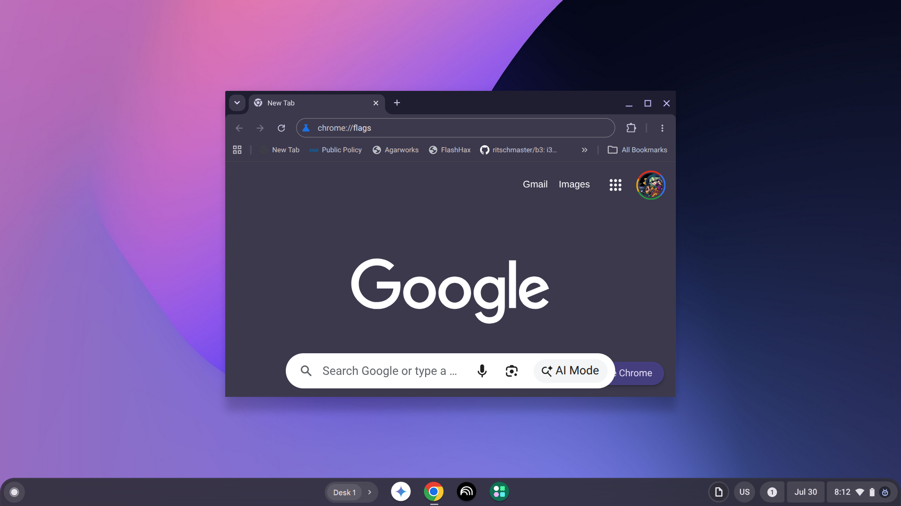
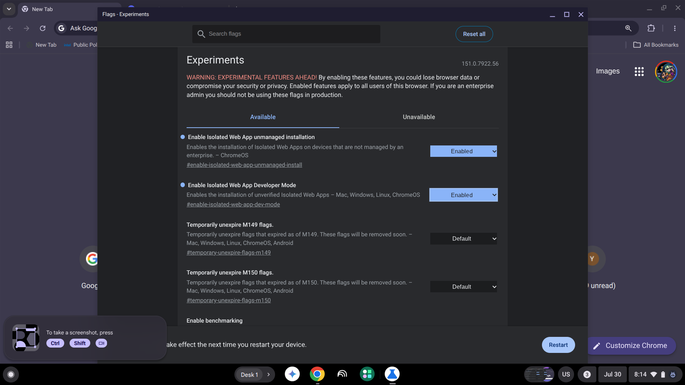
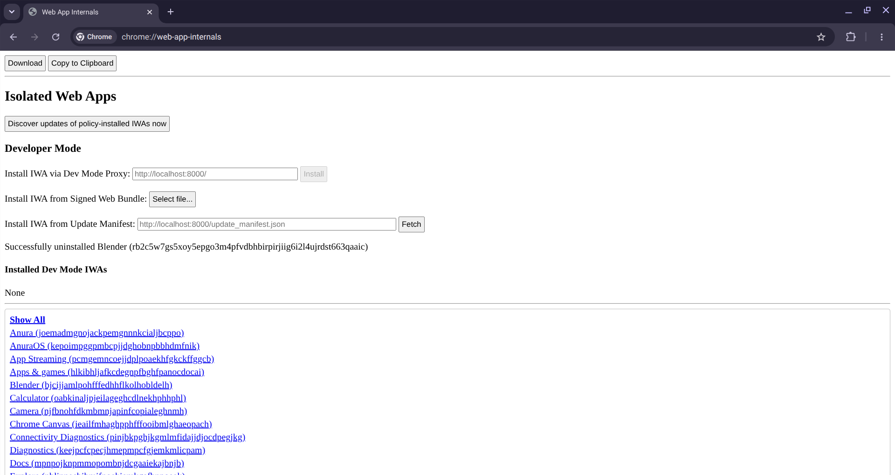
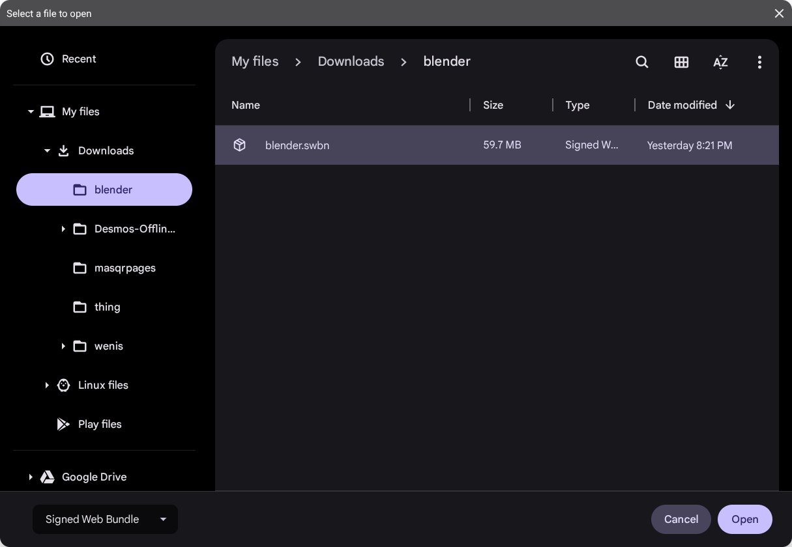
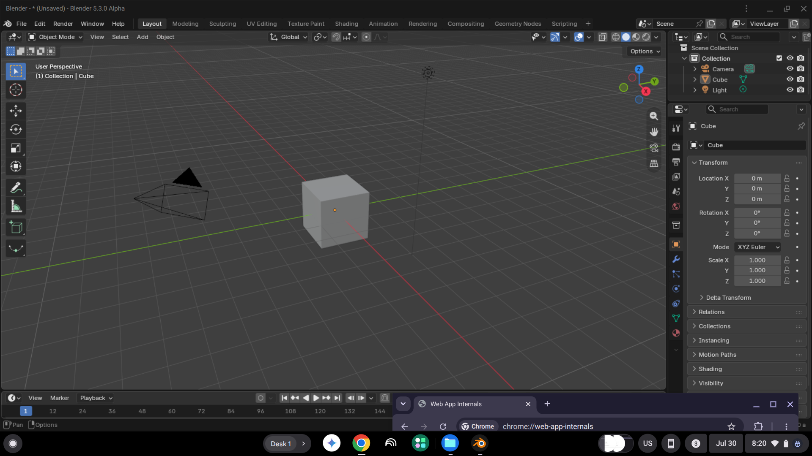

# Installing Blender for ChromeOS
As a side effect of the main port, we've developed a ChromeOS native version which does not require you to be online to use and performs better than running Blender in Crostini.

After downloading https://github.com/HeyPuter/blender-wasm/releases/download/chromeOS-build/blender5.swbn,

1. To install, update to atleast ChromeOS 134.
2. Navigate to chrome://flags 
3. Enable "Enable Isolated Web APP unmanaged installation" and "Enable Isolated Web App Developer mode" 
    * Click "Restart" in the bottom banner to restart your ChromeOS shell. This will not reboot your laptop
4. Navigate to chrome://web-app-internals 
5. Click "Select File..." next to "Install IWA from Signed Web Bundle: "
6. Select blender.swbn 
7. Use blender 